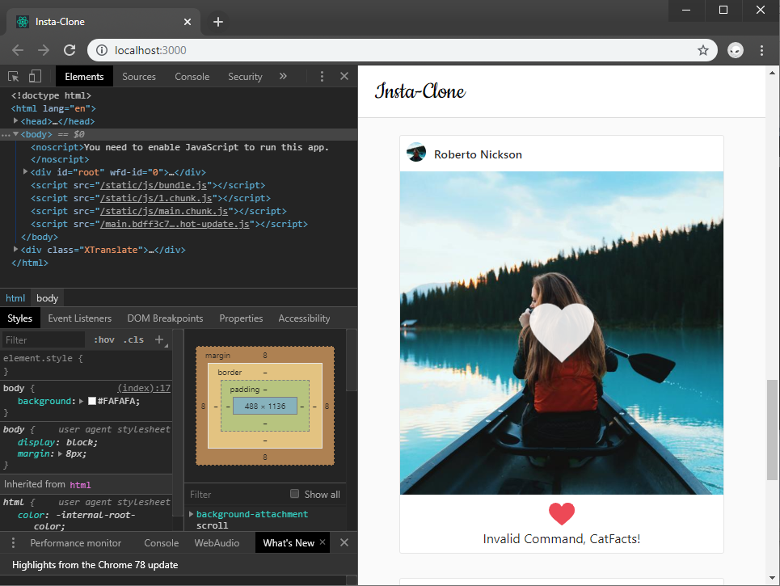
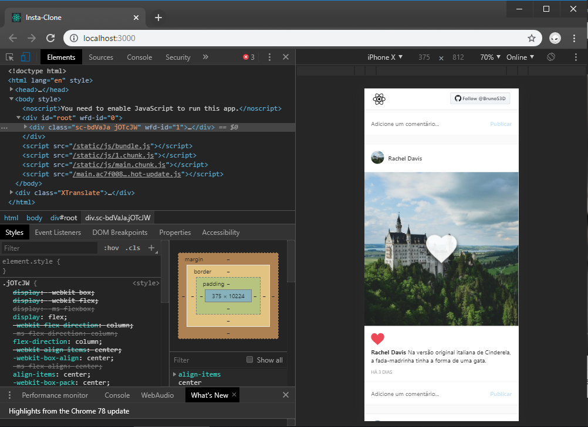
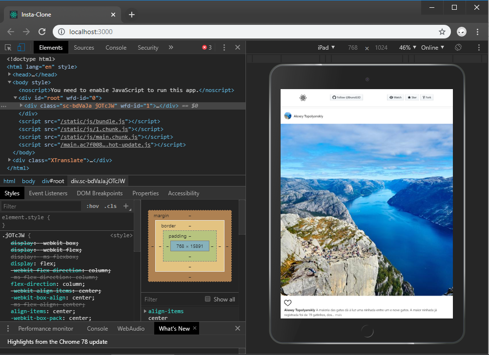

# Insta-Clone
 ⚛️ REACT.JS - Feed Dinâmico, Lazy-Load e visualização de imagens inspirado no Instagram.

---

## Live Preview:
Você pode testar o App no link a seguir:
>https://insta-clone.bruno3dcontato.now.sh/

### Funcionalidades:

1. Feed com carregamento dinâmico (Lorem Picsum).
2. Imagens com carregamento dinâmico (Lazy-Load).
3. Transição dinâmica entre imagens de baixa e alta resolução.
4. Duplo clique para curtir postagens.
5. Layout Resposivo.
6. Caixa de inserção de comentário.
7. Tamanho dinâmico para a descrição de cada postagem.

---

#### Lorem Picsum
Dispõe uma lista de imagens para construção do feed.
>https://picsum.photos/

### Observações importantes

```
As informações exibidas no Aplicativo não tem
autênticidade e podem ou não serem verdadeira,
são apenas informações com fim de preencher
campos de texto e imagem por simples ilustração
do Aplicativo. O aplicativo tem, como único fim,
o estudo sobre React e formas de tornar um WebSite
 reativo e responsivo de acordo com cada dispositivo.
```

# Browser View


# Mobile View


# Tablet View


# Lazy-Load Images

